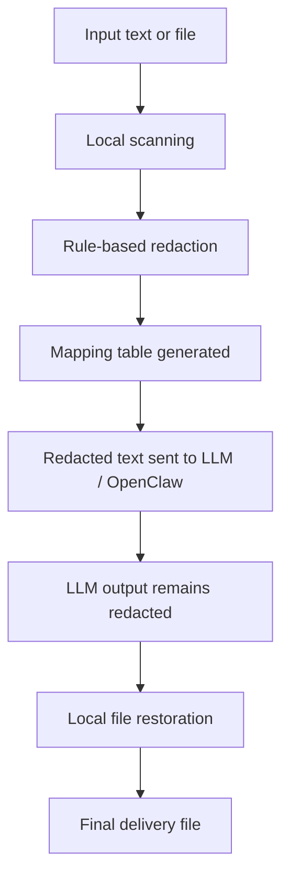

# reversible-redaction

A local reversible document redaction pipeline for enterprise document workflows.

## Goal

- Redact sensitive data before LLM processing
- Keep LLM outputs redacted
- Restore files locally for delivery using a mapping table
- Stay independent from DingTalk or any single chat platform

## Current status

- PRD defined
- Phase 1 implementation in progress

## Workflow

## Scope

- Text redaction
- Reversible placeholder mapping
- Local file restoration
- OpenClaw skill integration

See `docs/PRD.md` for the product direction.
