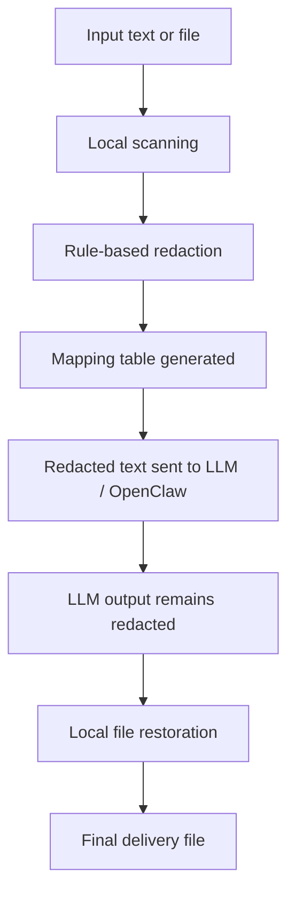

# reversible-redaction

A local reversible document redaction pipeline for enterprise document workflows.

## Goal

- Redact sensitive data before LLM processing
- Keep LLM outputs redacted
- Restore files locally for delivery using a mapping table
- Stay independent from DingTalk or any single chat platform

## Current status

- PRD defined
- Phase 1 implementation in progress

## Workflow



## Examples

### Input

```text
机房主机 10.1.2.3 上运行 kpw_proxy_72，手机号 13800000000
```

### Redacted output

```text
机房主机 [[IP_001]] 上运行 [[HOSTNAME_001]]，手机号 [[PHONE_001]]
```

### Mapping table

```json
[
  {"token": "[[IP_001]]", "kind": "ip", "original": "10.1.2.3"},
  {"token": "[[HOSTNAME_001]]", "kind": "hostname", "original": "kpw_proxy_72"},
  {"token": "[[PHONE_001]]", "kind": "phone", "original": "13800000000"}
]
```

## Scope

- Text redaction
- Reversible placeholder mapping
- Local file restoration
- OpenClaw skill integration

## Skill packaging

The packaged OpenClaw skill lives at `skills/reversible-redaction/SKILL.md`.
It only consumes redacted content and leaves restoration to the local pipeline.

See `docs/PRD.md` for the product direction.
